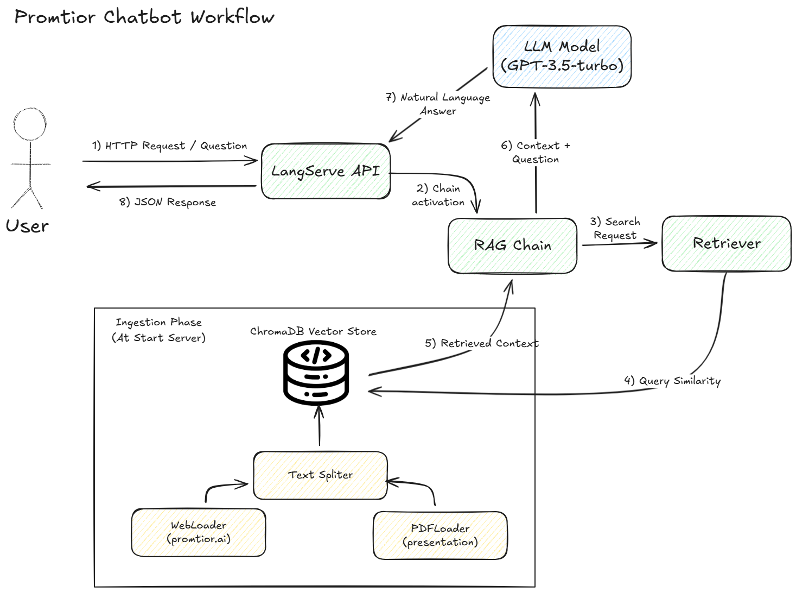

# Technical Report: Promtior RAG Chatbot

## 1. Project Overview & Approach
The objective of this challenge was to develop a chatbot capable of answering questions about Promtior's services, history, and clients using a **Retrieval-Augmented Generation (RAG)** architecture.

My approach focused on creating a **production-ready** solution rather than a simple script. To achieve this, I prioritized:
* **Scalability:** Using `LangServe` to expose the logic as a REST API.
* **Hybrid Data Ingestion:** Combining web content loading (fetched at startup) with static document loading (PDF presentation) to maximize context accuracy.
* **Robustness:** Implementing error handling for missing files and environment configuration.

## 2. Technologies Used
I selected a modern stack aligned with the industry standards for Generative AI:

* **Framework:** `LangChain` (for orchestrating the RAG pipeline).
* **Deployment:** `LangServe` (FastAPI) & `Railway` (Cloud Hosting).
* **LLM & Embeddings:** `OpenAI GPT-3.5-turbo` & `OpenAIEmbeddings` (chosen for the balance between speed, cost, and reasoning capability).
* **Vector Store:** `ChromaDB` (Local vector database for efficient similarity search).
* **Tools:** `BeautifulSoup4` (Web parsing) and `PyPDF` (PDF processing).

## 3. Implementation Logic
The solution follows a standard ETL (Extract, Transform, Load) pipeline adapted for RAG:

1.  **Ingestion:** The system loads data from multiple pages of the Promtior website (`/`, `/service`, `/use-cases`) using `WebBaseLoader`. It conditionally checks for the existence of `Promtior_Presentation.pdf` to load it using `PyPDFLoader` if available.
2.  **Splitting:** Text is divided into chunks of 1000 characters with a 200-character overlap using `RecursiveCharacterTextSplitter` to preserve context between segments.
3.  **Indexing:** Chunks are embedded and stored in `ChromaDB`.
4.  **Retrieval & Generation:** A chain is created where user queries trigger a similarity search. The retrieved context is passed to the LLM with a strict prompt to answer *only* based on that context.
5.  **Serving:** The chain is exposed via `LangServe` endpoints (`/chain/invoke`, `/chain/playground`).

## 4. Component Diagram
The following diagram illustrates the data flow from ingestion to user response:

## 5. Challenges & Solutions
During the development, I encountered and overcame the following technical challenges:

* **Dependency Management on Windows:**
    * *Challenge:* Installing `chromadb` required C++ build tools not present in the environment.
    * *Solution:* Configured the environment with Visual Studio Build Tools to allow proper compilation of wheels.
* **Dynamic Source Handling:**
    * *Challenge:* The system needed to be robust enough to run even if the optional PDF source was missing.
    * *Solution:* Implemented a Python `os.path.exists` check to conditionally load the PDF, printing a warning log instead of crashing the application.
* **Production Deployment:**
    * *Challenge:* Moving from local execution to the cloud (Railway).
    * *Solution:* Created a `Procfile` to define the uvicorn entry point and configured Environment Variables (`OPENAI_API_KEY`) securely in the cloud dashboard.